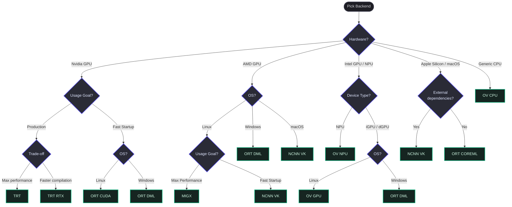

# VapourSynth MLRT (Machine Learning Runtime Tools) Backends

This document lists all the backends available in `vsmlrt` distributed by **[VSWheels](https://github.com/Jaded-Encoding-Thaumaturgy/vs-wheels)**.
The upstream project is [AmusementClub/vs-mlrt](https://github.com/AmusementClub/vs-mlrt).

## Summary Table of Backends

| Backend          | Wheel Package               | Supported Platforms (CI Builds) | Dependencies / API                       | Target Hardware                                      |
| :--------------- | :-------------------------- | :------------------------------ | :--------------------------------------- | :--------------------------------------------------- |
| **`ORT CPU`**    | `vapoursynth-mlrt-ort`      | Windows, Linux, macOS           | ONNX Runtime (CPU)                       | Standard CPU inference                               |
| **`ORT CUDA`**   | `vapoursynth-mlrt-ort-cuda` | Windows, Linux                  | ONNX Runtime (CUDA), CUDA Toolkit, cuDNN | NVIDIA GPUs                                          |
| **`ORT DML`**    | `vapoursynth-mlrt-ort`      | Windows                         | ONNX Runtime (DirectML), Direct3D 12     | DirectX 12-capable GPUs                              |
| **`ORT COREML`** | `vapoursynth-mlrt-ort`      | macOS                           | ONNX Runtime (CoreML)                    | Apple Silicon                                        |
| **`OV CPU`**     | `vapoursynth-mlrt-ov`       | Windows, Linux, macOS           | OpenVINO, ONNX                           | Standard CPU inference                               |
| **`OV GPU`**     | `vapoursynth-mlrt-ov`       | Windows, Linux x64              | OpenVINO, OpenCL                         | Intel Integrated Graphics, dedicated GPUs via OpenCL |
| **`OV NPU`**     | `vapoursynth-mlrt-ov`       | Windows, Linux                  | OpenVINO, Intel NPU drivers              | Intel Core Ultra Neural Processing Units (NPUs)      |
| **`TRT`**        | `vapoursynth-mlrt-trt`      | Windows, Linux                  | TensorRT, CUDA Toolkit                   | NVIDIA GPUs                                          |
| **`TRT RTX`**    | `vapoursynth-mlrt-trt_rtx`  | Windows, Linux                  | TensorRT RTX, CUDA Toolkit               | NVIDIA RTX GPUs                                      |
| **`NCNN VK`**    | `vapoursynth-mlrt-ncnn`     | Windows, Linux, macOS           | NCNN, Vulkan SDK, ONNX                   | Broad GPU support via Vulkan                         |
| **`MIGX`**       | `vapoursynth-mlrt-migx`     | Linux x64                       | AMD ROCm/HIP, MIGraphX, MIOpen, rocBLAS  | AMD Radeon / Instinct GPUs (ROCm-capable)            |

## Picking the Right Backend

Below is a decision tree to help select the most suitable backend depending on your hardware, operating system, and performance requirements:

## Notes

- The MIGX backend requires MIGraphX and ROCm/HIP to be installed separately.
  Install `migraphx` through your system package manager, for example `dnf install migraphx`.
- On macOS, the NCNN backend requires Vulkan support through MoltenVK.
  Install it with Homebrew, for example `brew install molten-vk`.
- The TRT and TRT RTX wheels do not bundle `trtexec` or `tensorrt_rtx`.
  Use the `vsscale` (vsjetpack) Python API for engine generation, or provide the matching external executable yourself.
